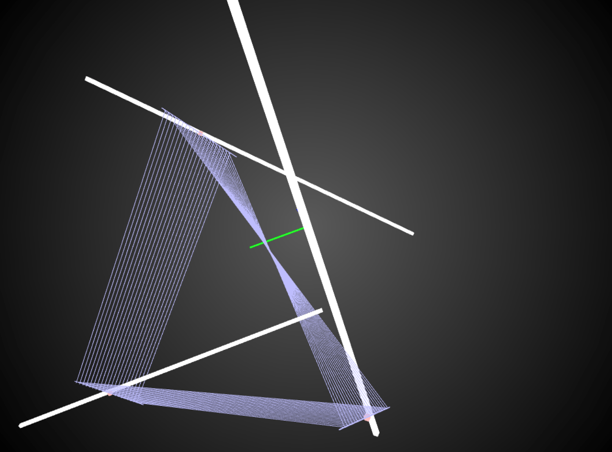

Loom
====

Simulation for an installation idea. Three rails with spinning motors and flexible string.

Loom is a kinetic installation that hangs above the audience, looking for congregations and weaving the tapestry of those gatherings. Rotating arrays of woven string are tied to loom-like connectors on three different actuated linear rails. Dancing above the visitors heads, these arrays of string will construct novel planes and surfaces in the Lobby space. The generative planes are lit from the side and above, creating an ethereal, space-bending effect for the visitors to experience.

